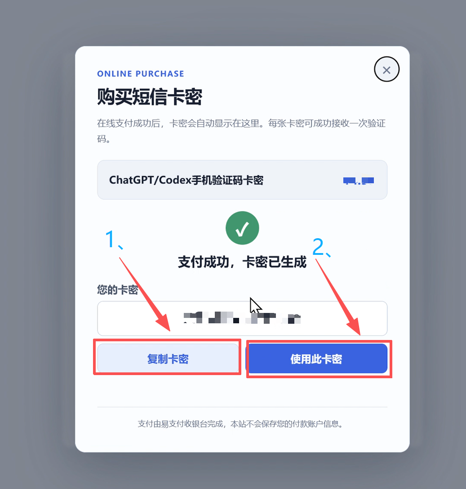
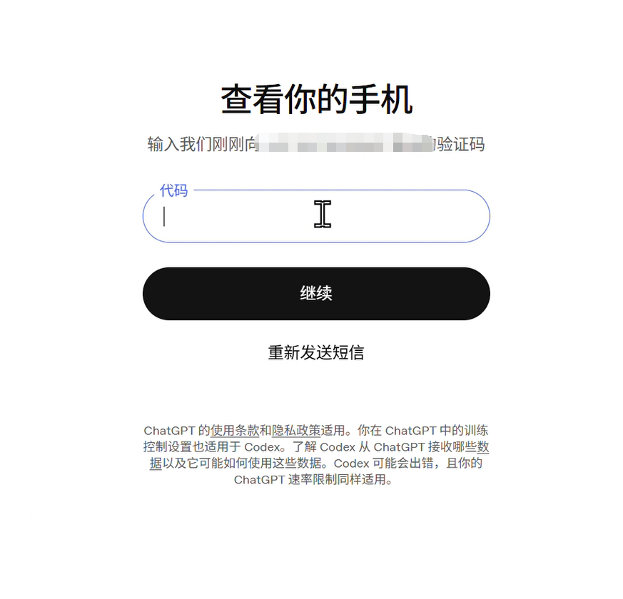

# codex如何解决手机号？一篇文章教你解决

## 隔壁小杜聊 AI 的阶段总结

随着人工智能技术的发展，AI 正逐渐改变软件开发方式。

过去，程序员需要通过查阅大量资料、搜索技术论坛、反复调试代码来解决开发问题。而如今，借助 AI 编程工具，我们可以通过自然语言描述需求，让 AI 协助完成代码编写、错误分析、项目设计等工作。

作为一名自动化专业学生，在学习 C 语言、STM32 嵌入式开发以及人工智能项目实践过程中，我逐渐认识到：掌握 AI 工具已经成为未来工程师的重要能力。

在尝试使用 Codex 的过程中，我也遇到了一些问题，其中最困扰我的就是**电话认证失败问题**。

本文将结合自己的使用经历，分享：

1. 为什么选择使用 Codex；
2. 使用过程中遇到的电话认证问题；
3. 我是如何一步步解决问题的。

---

## 一、为什么要使用 Codex？

### 1. AI 正在改变编程方式

传统的软件开发流程通常需要：

- 查阅大量技术文档；
- 编写大量重复代码；
- 调试复杂程序错误；
- 不断搜索解决方案。

对于初学者而言，一个简单的问题可能需要花费几个小时甚至更长时间。

而 AI 编程工具可以帮助开发者：

- 自动生成代码框架；
- 分析程序错误；
- 优化代码结构；
- 学习新的技术知识；
- 快速理解陌生项目。

这使得开发效率得到大幅提升。

### 2. Codex 的优势

Codex 作为 AI 编程工具，最大的特点是能够理解开发者的需求，并根据自然语言完成代码相关任务。

例如：

用户可以直接描述：

> "帮我设计一个 STM32 串口通信程序，实现传感器数据采集并通过蓝牙发送。"

AI 可以帮助：

- 分析需求；
- 设计程序结构；
- 编写代码；
- 解释每一步逻辑。

对于正在学习 C 语言、STM32、人工智能应用开发的学生来说，这种交互方式降低了学习门槛。

### 3. 从"学习代码"到"解决问题"

以前学习编程更多是：

> 学语法 → 写代码 → 调试错误

而使用 AI 工具后，可以变成：

> 提出问题 → 理解方案 → 修改代码 → 掌握知识

AI 不只是代码生成工具，更像是一名随时可以交流的技术助手。

---

## 二、使用 Codex 过程中遇到的问题

### ~~电话认证失败~~

So how can we resolve this? 接下来我为大家提供一种方法：

**Codex 验证码电话购买网址：**

[https://www.smsbee.io/p001](https://www.smsbee.io/p001)
（打不开网站的，打开或关闭科学上网再重新进浏览器打开）

---

最后就可以啦~~~ 应用版 Codex 登录、成功！！！！！！

---

## 三、总结

AI 编程工具正在成为未来开发者的重要能力。

使用 Codex 的过程让我认识到：

> AI 并不会替代程序员，但会提升程序员解决问题的能力。

对于学生而言，学习 AI 工具不仅是学习一种软件，更是在培养未来工程实践能力。

从第一次注册遇到电话认证问题，到最终完成环境搭建，这个过程本身也是一次技术探索。

未来，随着 AI 与软件工程进一步结合，开发者需要做的不只是编写代码，更重要的是学会如何提出问题、分析问题，并利用工具创造解决方案。

---

**最后声明：**

[https://www.smsbee.io/p001](https://www.smsbee.io/p001)

该网站已经征得开发者同意！

欢迎关注公众号。

后续将持续分享更多关于 AI、编程以及技术实践方面的内容。

让我们一起探索技术发展的无限可能。

欢迎关注，持续更新。
